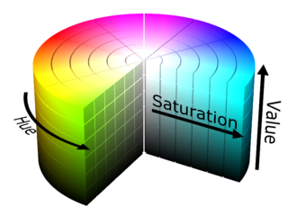
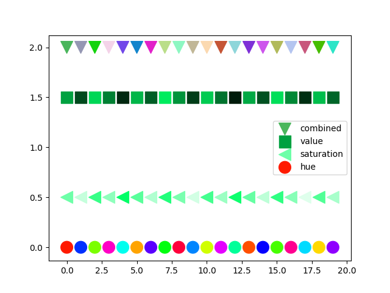

ColorSequence
=============

.. inclusion-p1

A package to provide distinct colors.

The idea behind this package is to generate colours from the `HSV-colorspace`_ by generation evenly distributed values in each dimension (hue, saturation, value).

The package uses the `golden angle`_ to create evenly distributed values in the range of values you specify.

.. _golden angle: https://en.wikipedia.org/wiki/Golden_angle
.. _HSV-colorspace: https://en.wikipedia.org/wiki/HSL_and_HSV#HSV_to_RGB

You can either create a list of colors or a generator that will allow you to
continuously draw new distinct colors.

.. exclusion-p1

  
  HSV-colorspace: A specific color is determined by the triple hue, saturation and value, each takes a value within [0, 1]. source: `wikipedia`_ 

.. _wikipedia: https://commons.wikimedia.org/wiki/File:HSV_color_solid_cylinder.png

Simple example
==============

.. code-block:: python

        from matplotlib import pyplot as plt
        from colorseq import DistinctColors

        dc_h = DistinctColors(20, (0.0, 1.0), 1.0, 1.0)
        dc_s = DistinctColors(20, 0.4, (0.1, 1.0), 1.0)
        dc_v = DistinctColors(20, 0.4, 1.0, (0.1, 1.0))
        dc_comb = DistinctColors(
                20, (0.0, 1.0), (0.1, 1.0), (0.7, 1.0),
                h_shuffle=True, s_shuffle=True, v_shuffle=True
                )
        colors_h = dc_h.get_colors()
        colors_s = dc_s.get_colors()
        colors_v = dc_v.get_colors()
        colors_comb = dc_comb.get_colors()
        fig, ax = plt.subplots()
        ax.scatter(
                [*range(20)], [2 for _ in range(20)], s=200.0,
                c=colors_comb, marker='v', label='combined'
                )
        ax.scatter(
                [*range(20)], [1.5 for _ in range(20)], s=200.0,
                c=colors_v, marker='s', label='value'
                )
        ax.scatter(
                [*range(20)], [0.5 for _ in range(20)],
                s=200.0, c=colors_s, marker='<', label='saturation'
                )
        ax.scatter(
                [*range(20)], [0 for _ in range(20)], s=200.0,
                c=colors_h, label='hue'
                )
        ax.legend(loc='best', numpoints=4)
        plt.show()

You can find the script `here`_.

.. _here: examples/simple_scatter.py

.. inclusion-p2

Installation
=============

You can get the latest version with

.. code-block:: console

    pip install --upgrade --no-deps git+https://github.com/j-i-l/ColorSequence.git

.. exclusion-p2

Documentation
==============

http://colorsequence.rtfd.io/
